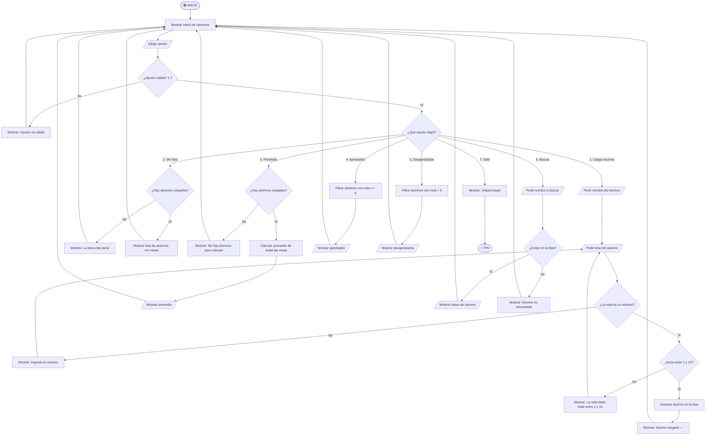

```mermaid
flowchart TD
A([🟢 INICIO]) --> B[Mostrar menú de opciones]
B --> C[/Elegir opción/]
C --> D{¿Opción válida? 1-7}
D -->|No| E[Mostrar: Opción no válida] --> B
D -->|Sí| F{¿Qué opción eligió?}
F -->|1. Cargar alumno| G[/Pedir nombre del alumno/]
G --> H[/Pedir nota del alumno/]
H --> I{¿La nota es un número?}
I -->|No| J[Mostrar: Ingresá un número] --> H
I -->|Sí| K{¿Nota entre 1 y 10?}
K -->|No| L[Mostrar: La nota debe estar entre 1 y 10] --> H
K -->|Sí| M[Guardar alumno en la lista] --> N[Mostrar: Alumno cargado ✅ ] --> B
F -->|2. Ver lista| O{¿Hay alumnos cargados?}
O -->|No| P[Mostrar: La lista está vacía] --> B
O -->|Sí| Q[Mostrar lista de alumnos con notas] --> B
F -->|3. Promedio| R{¿Hay alumnos cargados?}
R -->|No| S[Mostrar: No hay alumnos para calcular] --> B
R -->|Sí| T[Calcular promedio de todas las notas] --> U[/Mostrar promedio/] --> B
F -->|4. Aprobados| V[Filtrar alumnos con nota >= 6] --> W[/Mostrar aprobados/] --> B
F -->|5. Desaprobados| X[Filtrar alumnos con nota < 6] --> Y[/Mostrar desaprobados/] --> B
F -->|6. Buscar| Z[/Pedir nombre a buscar/]
Z --> AA{¿Existe en la lista?}
AA -->|Sí| AB[/Mostrar datos del alumno/] --> B
AA -->|No| AC[Mostrar: Alumno no encontrado] --> B
F -->|7. Salir| AD[Mostrar: ¡Hasta luego!] --> AE([🔴 FIN])
```
